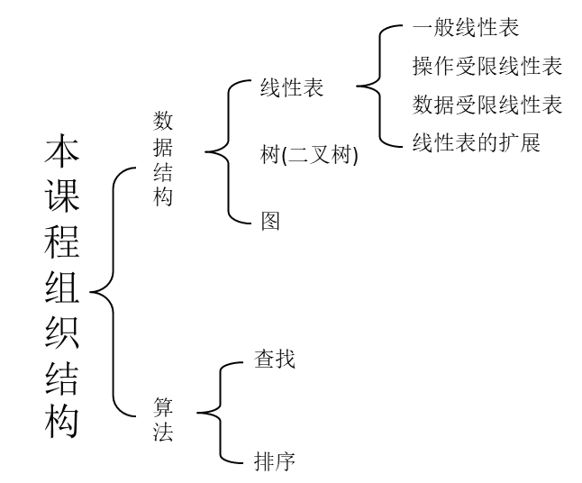
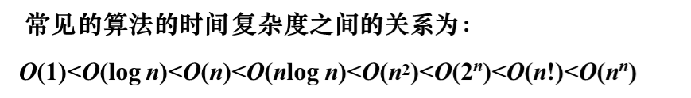

## 数据结构综述

**算法的五个特性：有穷性、确定性、可行性、0/多个输入、1/多个输出**

**算法的设计要求：正确性、可读性、健壮性、高效率、低存储**

**算法与程序的区别：**

1. 一个程序不一定满足有穷性
2. 程序中的指令必须是机器可执行的，而算法中的指令则无此限制，算法若用计算器语言来书写，则它就可以是程序。
3. 一个算法可以用自然语言、数学语言或约定符号来描述，也可以用流程图，计算机高级程序语言或伪代码描述。

**一个算法所需存储空间：**

1. 算法本身的存储空间
2. 输入数据的存储空间
3. **算法在运行过程中临时占用的存储空间**（空间复杂度）

**数据：**

是对客观事物的符号表示，在计算机科学中是指所有能输入到计算机中并呗计算机程序处理的符号的总称。

**数据结构：**

是相互之间存在一种或多种特定关系的数据元素的集合，也可称其为逻辑结构。

**四种基本数据结构：**

集合、线性表、树、图

